# Introduction

Dans le cadre du module "*Python pour la datascience*" (**DSIA-4101A**), nous avons eu l'opportunité de réutiliser les notions de langage Python vues dans le cours pour produire un rapport d'étude sur un sujet que l'on choisit, en répondant à une problématique. Le travail fut réaliser en binôme et l'objectif fut de produire un Dash d'un jeu de données accessibles publiquement et non modifiées.

Notre responsable fut **COURIVAUD Daniel**, et notre binôme fut composé de  **Andrianihary RAZAFINDRAMISA** et de **Xianli LI**.
  
Nous avons choisi de travailler sur les jeux de données :
- *[Insertion professionnelle des diplômé.e.s de Diplôme universitaire de technologie (DUT) en universités et établissements assimilés - données nationales par disciplines détaillées](https://www.data.gouv.fr/fr/datasets/insertion-professionnelle-des-diplome-e-s-de-diplome-universitaire-de-technologie-dut-en-universites-et-etablissements-assimiles-donnees-nationales-par-disciplines-detaillees/#_)*
  > *source: data.gouv.fr*
- *[Insertion professionnelle des diplômé.e.s de Licence professionnelle en universités et établissements assimilés](https://www.data.gouv.fr/fr/datasets/insertion-professionnelle-des-diplome-e-s-de-licence-professionnelle-en-universites-et-etablissements-assimiles/#_)*
  > *source: data.gouv.fr*
- *[Insertion professionnelle des diplômés de Master en universités et établissements assimilés](https://www.data.gouv.fr/fr/datasets/insertion-professionnelle-des-diplomes-de-master-en-universites-et-etablissements-assimil-0/#_)*
  > *source: data.gouv.fr*

#### Problématique
Nous avons choisi de répondre à la problématique : <ins>*Le choix des diplômes et le nombre d'années d'étude sont-ils primordiaux pour l'insertion professionnelle ?*</ins>

<br>

___

# Table des matières

[[_TOC_]]
___


# I. Guide utilisateur

## 1. Installation & Téléchargement

### A. Python
Dans un premier temps, afin d'exploiter notre projet, il faudra télécharger et installer le langage de base ***Python v3.X.X*** sur votre appareil. Pour cela, que votre appareil soit sous Linux, macOS, Windows ou autre, vous pouvez trouver la page de téléchargement de Python en cliquant [ici](https://www.python.org/downloads/). Puis suivez les instructions d'installation.

Après l'installation, vérifiez le fonctionnement sur votre appareil en tapant les commandes suivantes sur le terminal, l'nvite de commandes, le PowerShell ou autre selon votre système d'exploitation:

```bash
$ python3 --version
Python 3.X.X
```

ou

```bash
$ python --version
Python 3.X.X
```

Dans le cas où vous n'avez pas ***Python v3.X.X*** en résultat, il faut réinstaller Python.

### B. *pip*

Dans un second temps, des packages supplémentaires sont nécessaires au bon fonctionnement de notre projet alors il faudra installer *pip* (si la version de Python est plus ancienne que **Python 2.7.9** ou **Python 3.4**) grâce à ce [lien](https://pip.pypa.io/en/stable/installing/).

### C. Le dashboard

#### Télécharger le projet

Le projet se trouve sur un dépôt Git se situant sur [cette page](https://git.esiee.fr/lix/projet-python). Ce dépôt pourra être "*cloné*" dans un répertoire de travail que vous avez créé sur votre ordinateur.

#### Packages nécessaires

Des packages supplémentaires sont nécessaires au bon fonctionnement de notre projet :

```bash
# standard library
import os
import pathlib

# dash libs
import dash
from dash.dependencies import Input, Output, State
import dash_core_components as dcc
import dash_html_components as html
import dash_table
import dash_daq as daq

import plotly.figure_factory as ff
import plotly.graph_objs as go
import plotly.express as px
import flask

# pydata stack
import pandas as pd
import numpy as np
import json
import plotly.graph_objects as go
```

On peut utiliser les commandes suivantes pour les télécharger et les installer :

```bash
pip install package
```

```bash
pip3 install package
```

```bash
python -m pip install package
```

```bash
python3 -m pip install package
```

où "package" est le nom du package à installer.

## 2. Exécution

### A. Windows

Lancez un invité de commande/cmd/powershell puis placez vous dans le dossier du projet:

- Sous CMD
```shell
> CD [Le chemin menant au dossier]
> DIR
...
```

- Sous powershell
```shell
> cd [Le chemin menant au dossier]
> ls
README.md     main.py     images
```

On peut utiliser les commandes suivantes pour lancer l'application :
```bash
$ python3 main.py
```
ou
```bash
$ python main.py
```

### B. Linux & macOS
Lancez un terminal/invité de commandes/console au niveau du projet:
```bash
$ cd [Le chemin menant au dossier]
$ ls
README.md     main.py     images
```

On peut utiliser les commandes suivantes pour lancer l'application :
```bash
$ python3 main.py
```
Ou
```bash
$ python main.py
```

Une fois exécuté, vous devriez avoir cet affichage :
```bash
$ python3 main.py
Dash is running on http://127.0.0.1:8050/

 * Serving Flask app "app" (lazy loading)
 * Environment: production
   WARNING: This is a development server. Do not use it in a production deployment.
   Use a production WSGI server instead.
 * Debug mode: on
```

## 3. Utilisation

Une fois éxécuté, le "*dashboard*" est accessible à l'adresse [http://127.0.0.1:8050/](http://127.0.0.1:8050/).

### A. Bar de navigation

Lorsque l'installation et l'éxecution ont bien été respéctés alors on se retrouve sur la page suivante:  

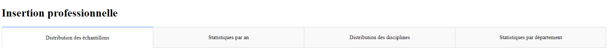

Il y a quatre pages :
- *Distribution des échantillons*,
- *Statistiques par an*,
- *Distribution des disciplines*,
- et *Statistiques par département*.
Ces pages sont accessibles en cliquant sur leur label, sous le titre, en haut de la page.

### B. *Distribution des échantillons*

Une fois l'installation et l'exécution réussies, l'application s'ouvre sur la page suivante:

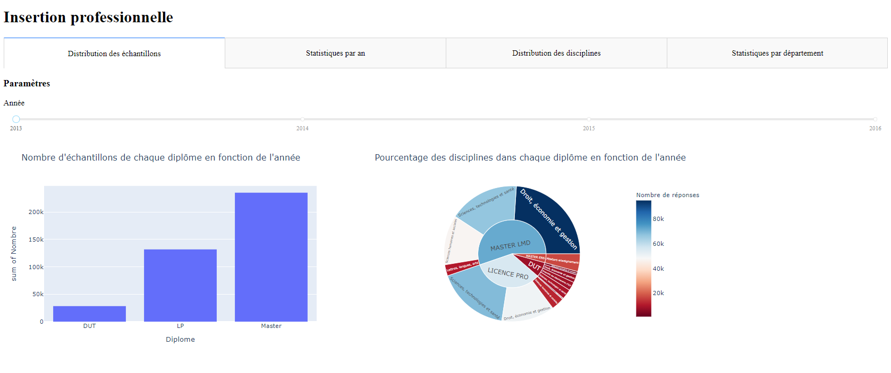

- #### Paramètres

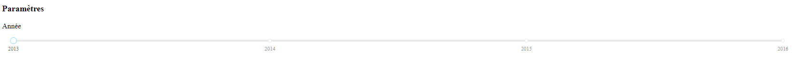

La partie supérieure de la page présente les paramètres permettant d'intéragir avec les graphes. Le "*slider*" permet de choisir une année ou de faire défiler les années. 

- #### Partie principale


La partie inférieure de la page affiche un histogramme du nombre d'échantillons de chaque diplôme, et un camembert du pourcentage de chaque discipline, dans chaque diplôme, en fonction de l'année que l'on choisit avec le "*slider*" situé au-dessus des graphes. En plus de définir une année, le slider permet également de les faire défiler. Cela permet de voir la progression et la distribution du nombre d'échantillons et du pourcentage de chaque discipline au cours des années.

### C. *Statistiques par an*

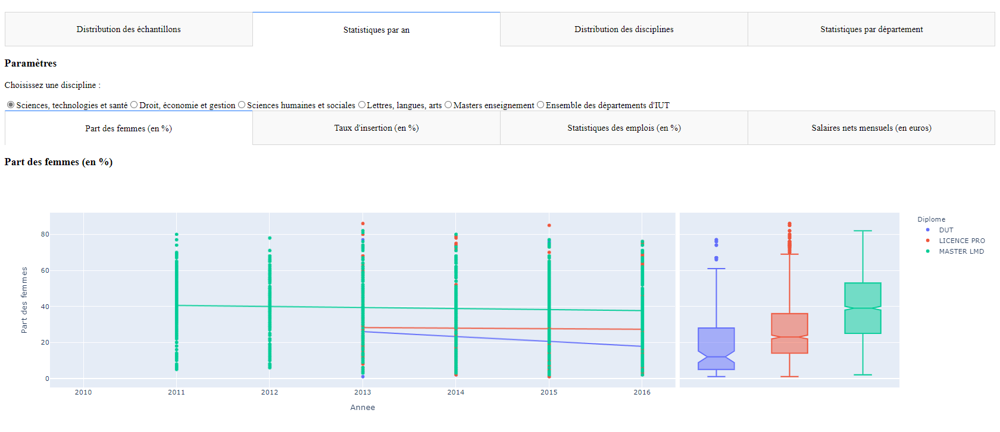

- #### Paramètres

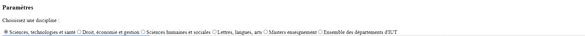

Ce bloc permet de contrôler les différents graphes présents dans le bloc inférieur, en modifiant la *discipline*.

- #### Evolution du taux d'insertion au cours du temps

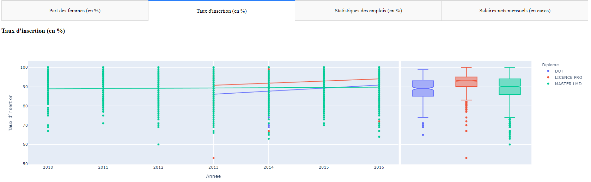

Ce graphe montre l'évolution de la tendance et de la distribution du taux d'insertion (en %) de chaque diplôme au cours des années en fonction de la discipline choisie. L'abscisse représente les années et l'ordonnée le taux d'insertion (en %).

- #### Evolution des statistiques des emplois au cours du temps 

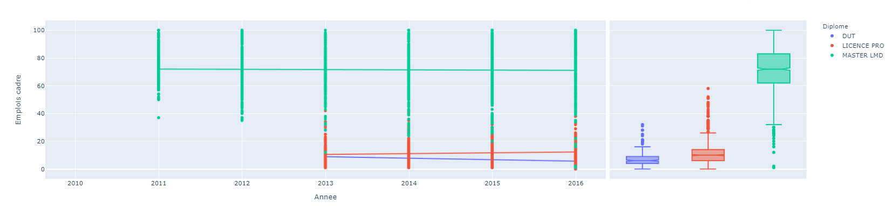

Ce graphe montre l'évolution de la tendance et de la distribution du taux d'emplois cadres (en %) de chaque diplôme au cours des années en fonction de la discipline choisie. L'abscisse représente les années et l'ordonnée le taux d'emplois cadres (en %).

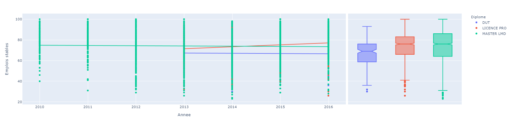

Ce graphe montre l'évolution de la tendance et de la distribution du taux d'emplois stables (en %) de chaque diplôme au cours des années en fonction de la discipline choisie. L'abscisse représente les années et l'ordonnée le taux d'emplois stables (en %).

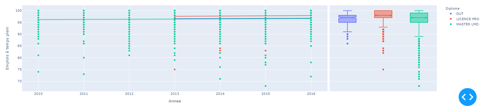

Ce graphe montre l'évolution de la tendance et de la distribution du taux d'emplois à temps plein (en %) de chaque diplôme au cours des années en fonction de la discipline choisie. L'abscisse représente les années et l'ordonnée le taux d'emplois à temps plein (en %).

- #### Evolution de la part des femmes au cours du temps

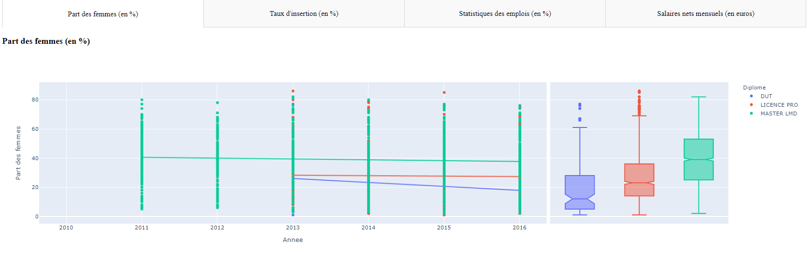

Ce graphe montre l'évolution de la tendance et de la distribution de la part des femmes (en %) de chaque diplôme au cours des années en fonction de la discipline choisie. L'abscisse représente les années et l'ordonnée la part des femmes (en %).

- #### Evolution des salaires nets mensuels au cours du temps

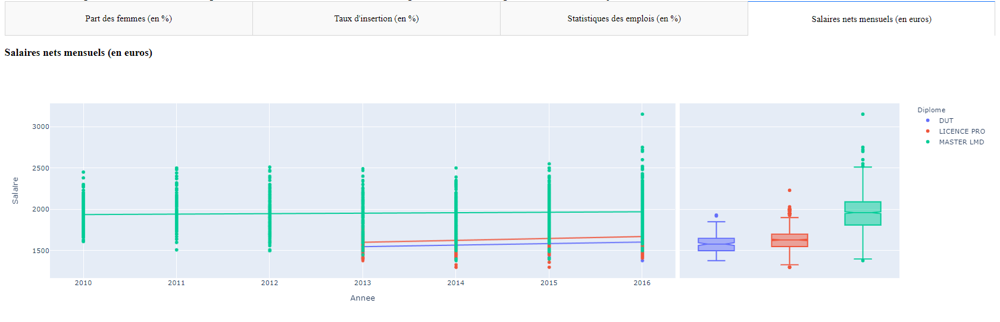

Ce graphe montre l'évolution de la tendance et de la distribution des salaires nets mensuels (en euros) de chaque diplôme au cours des années en fonction de la discipline choisie. L'abscisse représente les années et l'ordonnée les salaires nets mensuels (en euros).

### D. *Distribution des disciplines*

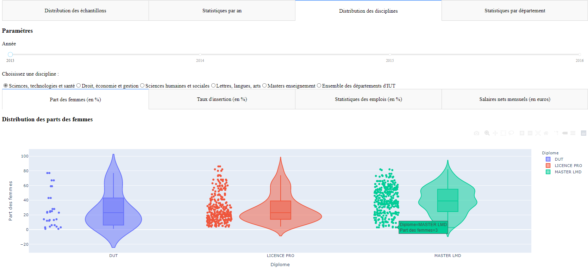

- #### Paramètres

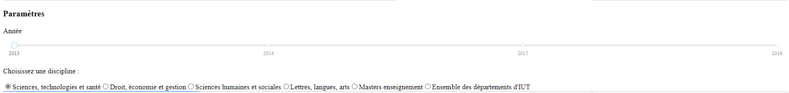

Ce bloc permet de contrôler les différents graphes présents dans le bloc inférieur, en modifiant l'*année* avec un slider et en modifiant la *discipline* avec des radio buttons.

- #### Evolution du taux d'insertion au cours du temps

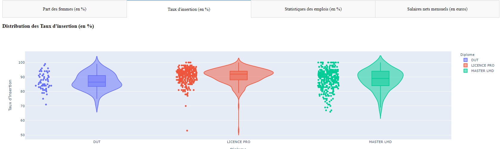

Le violin plot montre une représentation abstraite de la distribution empirique du taux d'insertion (en %) de chaque diplôme au cours des années et en fonction de la discipline choisie.
L'abscisse représente les types de diplôme et l'ordonnée le taux d'insertion (en %) de chaque diplôme. 

- #### Evolution des statistiques des emplois au cours du temps 

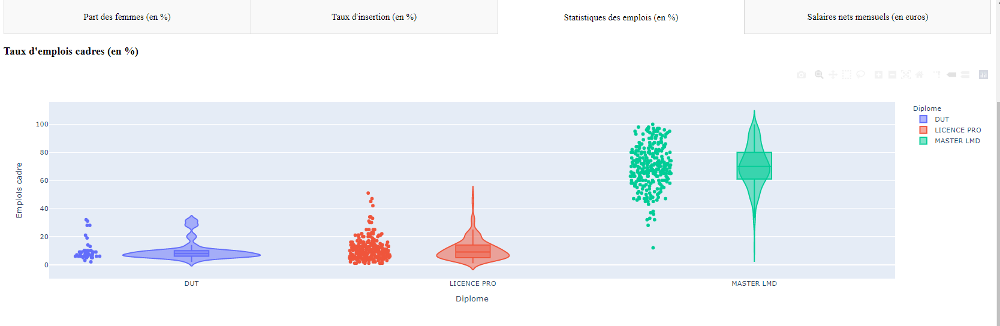

Le violin plot montre une représentation abstraite de la distribution empirique du taux d'emplois cadres (en %) de chaque diplôme au cours des années et en fonction de la discipline choisie.
L'abscisse représente les types de diplôme et l'ordonnée le taux d'emplois cadres (en %) de chaque diplôme.

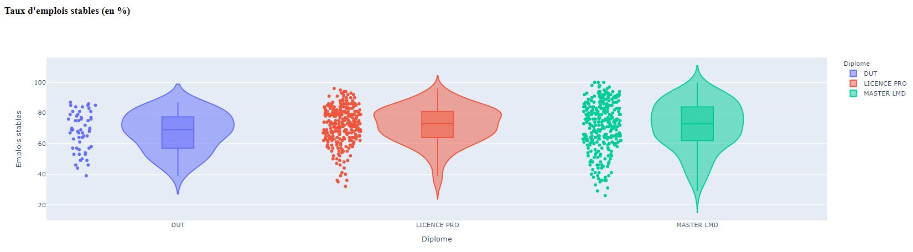

Le violin plot montre une représentation abstraite de la distribution empirique du taux d'emplois stables (en %) de chaque diplôme au cours des années et en fonction de la discipline choisie.
L'abscisse représente les types de diplôme et l'ordonnée le taux d'emplois stables (en %) de chaque diplôme.

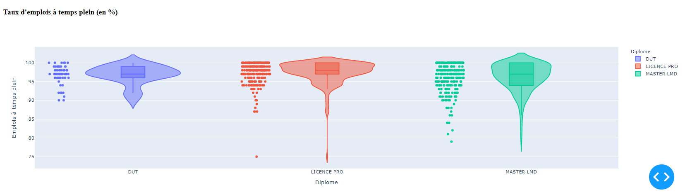

Le violin plot montre une représentation abstraite de la distribution empirique du taux d'emplois à temps plein (en %) de chaque diplôme au cours des années et en fonction de la discipline choisie.
L'abscisse représente les types de diplôme et l'ordonnée le taux d'emplois à temps plein (en %) de chaque diplôme.

- #### Evolution de la part des femmes au cours du temps

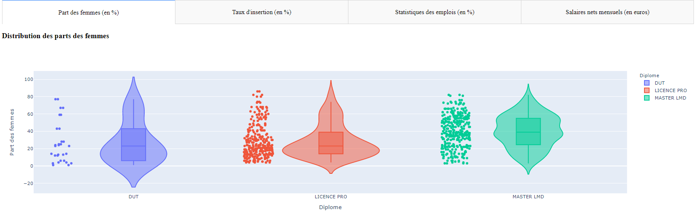

Le violin plot montre une représentation abstraite de la distribution empirique de la part des femmes (en %) de chaque diplôme au cours des années et en fonction de la discipline choisie.
L'abscisse représente les types de diplôme et l'ordonnée la part des femmes (en %) de chaque diplôme.

- #### Evolution des salaires nets mensuels au cours du temps

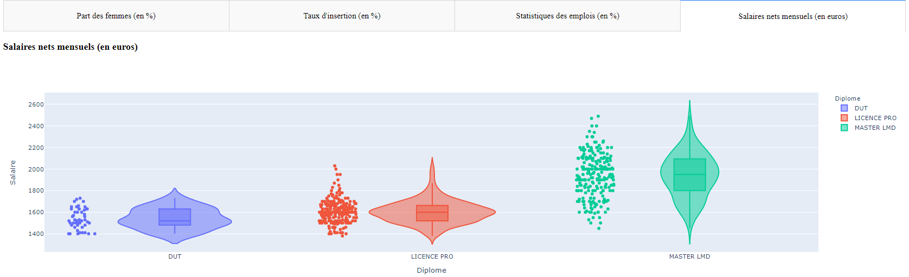

Le violin plot montre une représentation abstraite de la distribution empirique des salaires nets mensuels (en euros) de chaque diplôme au cours des années et en fonction de la discipline choisie.
L'abscisse représente les types de diplôme et l'ordonnée les salaires nets mensuels (en euros) de chaque diplôme.

### E. *Statistiques par département*

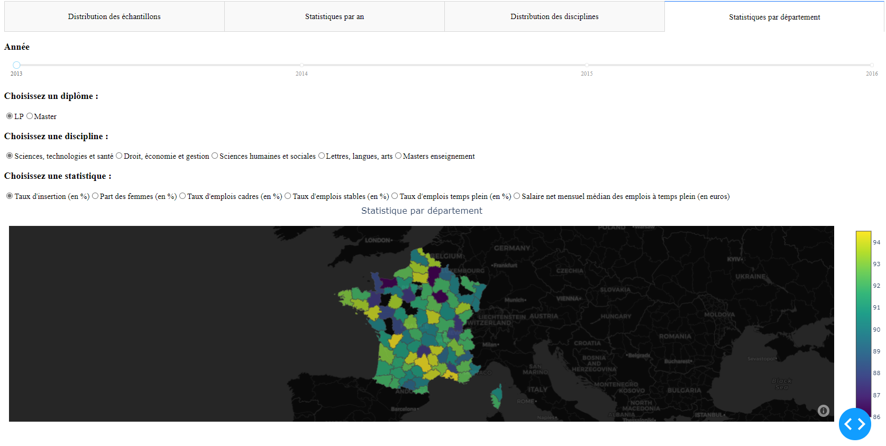

Seuls les jeux de données *[Insertion professionnelle des diplômé.e.s de Licence professionnelle en universités et établissements assimilés](https://www.data.gouv.fr/fr/datasets/insertion-professionnelle-des-diplome-e-s-de-licence-professionnelle-en-universites-et-etablissements-assimiles/#_)* et *[Insertion professionnelle des diplômés de Master en universités et établissements assimilés](https://www.data.gouv.fr/fr/datasets/insertion-professionnelle-des-diplomes-de-master-en-universites-et-etablissements-assimil-0/#_)* sont utilisés sur cette page.

- #### Paramètres

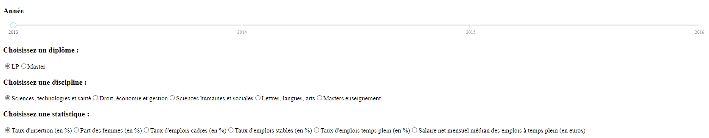

La partie gauche de la page présente les paramètres permettant d'intéragir avec la carte. Le "*slider*" permet de choisir une année ou de faire défiler les années, et les "*radio buttons*" permettent de choisir un diplôme, une discipline et une statistique. 

- #### Partie principale

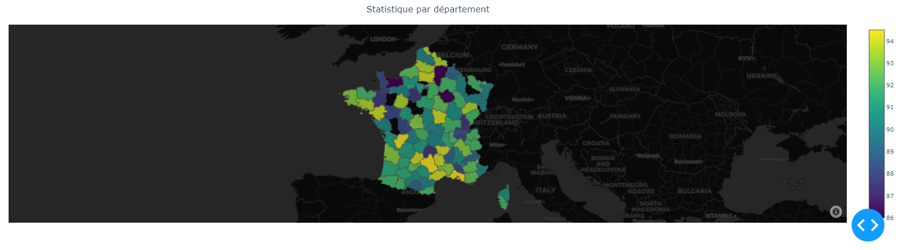

La partie droite de la page affiche une carte des départements de la France métropolitaine. On peut intéragir avec cette dernière grâce aux paramètres, situé à gauche de la carte. Ils permettent de choisir une discipline, un diplôme et une statistique afin d'afficher sur la carte le nom de chaque département avec les valeurs de la statistique choisie en fonction de la discipline et du diplôme choisis. Cela permet d'avoir plus d'informations sur un département spécifique grâce à une représentation géolocalisée des statistiques. De plus, cela permet de comparer un département, une région ou une académie par rapport à d'autres.
Pour pouvoir représenter les statistiques de chaque département sur la carte, nous avons décidé de prendre la médiane des données de chaque département étant donné que la taille des données est conséquente. Nous avons choisi la médiane, plutôt que la moyenne, car celle-ci est plus représentative.

# II. Guide développeur

Dans ce Developper Guide, la structure, le code et le rôle des fichiers dans le projet seront expliqués.

## 1. Les répertoires & fichiers

Dans cette partie, on explique le rôle du répertoire et des fichiers.

### A. *images*

Ce répertoire contient les images servant principalement à la rédaction de ce guide.

### B. *Jeux de données*

Voici l'ensemble des jeux de données utilisés pour le projet :

- ***fr-esr-insertion_professionnelle-dut_donnees_nationales.csv*** : le jeu de données sur les diplômes universitaires de technologie, *[Insertion professionnelle des diplômé.e.s de Diplôme universitaire de technologie (DUT) en universités et établissements assimilés - données nationales par disciplines détaillées](https://www.data.gouv.fr/fr/datasets/insertion-professionnelle-des-diplome-e-s-de-diplome-universitaire-de-technologie-dut-en-universites-et-etablissements-assimiles-donnees-nationales-par-disciplines-detaillees/#_)*.

- ***fr-esr-insertion_professionnelle-lp.csv*** : le jeu de données sur les licences professionnelles, *[Insertion professionnelle des diplômé.e.s de Licence professionnelle en universités et établissements assimilés](https://www.data.gouv.fr/fr/datasets/insertion-professionnelle-des-diplome-e-s-de-licence-professionnelle-en-universites-et-etablissements-assimiles/#_)*.

- ***fr-esr-insertion_professionnelle-master.csv*** : le jeu de données sur les masters, *[Insertion professionnelle des diplômés de Master en universités et établissements assimilés](https://www.data.gouv.fr/fr/datasets/insertion-professionnelle-des-diplomes-de-master-en-universites-et-etablissements-assimil-0/#_)*.

- ***departements.geojson***: Le jeu de données contenant les délimitations des départements de la France métropolitaine ([source](https://france-geojson.gregoiredavid.fr/)). 

### C. *main.py*

Ce fichier contient le code permettant le traitement des données afin que l'on puisse les utiliser et les lire clairement. Il permet également de créer l'interface graphique et implémente le traitement dynamique des données en créant une interactivité entre les différents composants de l'application et les jeux de données.

### D. *README.md*

Le présent fichier *Markdown* qui contient:
- la présentation du projet avec la problématique,
- le guide de l'utilisateur avec les instructions d'exécution,
- le guide du développeur,
- et le rapport d'analyse.

## 2. Le code : main.py

#### - Le chargement des données

Dans cette section, on récupère les jeux de données nécessaires au fonctionnement de l'application. Par exemple:

```python
# Lecture des fichiers de source
diplome_dut = pd.read_csv("fr-esr-insertion_professionnelle-dut_donnees_nationales.csv", sep=';',na_values=["ns", "nd"])
diplome_lp = pd.read_csv("fr-esr-insertion_professionnelle-lp.csv", sep=';', na_values=["ns", "nd"])
diplome_master = pd.read_csv("fr-esr-insertion_professionnelle-master.csv", sep=';', na_values=["ns", "nd"])

...
```

#### - Les *packages*

Dans cette section, on charge les packages nécessaires pour le bon fonctionnement de l'application. 

```python
# standard library
import os
import pathlib

# dash libs
import dash
from dash.dependencies import Input, Output, State
import dash_core_components as dcc
import dash_html_components as html
import dash_table
import dash_daq as daq

import plotly.figure_factory as ff
import plotly.graph_objs as go
import plotly.express as px
import flask

# pydata stack
import pandas as pd
import numpy as np
import json
import plotly.graph_objects as go
```

#### - La création de l'interface de l'application

Dans cette section, on crée l'interface de l'application en définissant le contenu du menu et du corps de l'application. 

##### - La bar de navigation

```bash
...
# Construction des onglets principaux
def build_tabs():
    return html.Div(
        id="tabs",
        className="tabs",
        children=[
            dcc.Tabs(
                id="app-tabs",
                value="tab1",
                className="custom-tabs",
                children=[
                    # Premier onglet "Distribution des échantillons"
                    dcc.Tab(
                        id="Echtls-tab",
                        label="Distribution des échantillons",
                        value="tab1",
                        className="custom-tab",
                        selected_className="custom-tab--selected",
                    ),
                    # Deuxième onglet "Statistiques par an"
                    dcc.Tab(
                        id="An-tab",
                        label="Statistiques par an",
                        value="tab2",
                        className="custom-tab",
                        selected_className="custom-tab--selected",
                    ),
                    # Troisième onglet "Distribution des disciplines"
                    dcc.Tab(
                        id="Disciplines-tab",
                        label="Distribution des disciplines",
                        value="tab3",
                        className="custom-tab",
                        selected_className="custom-tab--selected",
                    ),
                    # Quatrième onglet "Statistiques par département"
                    dcc.Tab(
                        id="Ville-tab",
                        label="Statistiques par département",
                        value="tab4",
                        className="custom-tab",
                        selected_className="custom-tab--selected",
                    ),
                ],
            )
        ],
    )
...
```

Ici on crée la bar de navigation.

##### - Le corps de l'application

On crée le corps de l'application en définissant les différents éléments de chaque onglet. Par exemple :

```python
...
def build_tab_1():
    return [
        html.Div(
            id="top-row-graphs",
            children=[
                html.Div(
                    className="row",
                    children=[
                        html.Div(
                            id="map-container",
                            children=[
                                # le Slider filtre les données alimentant les trois graphes en dessous en fonction de l'année
                                html.H3("Paramètres"),
                                html.Div(
                                    id="header-container2",
                                    children=[
                                        build_graph_title("Année"),
                                        dcc.Slider(
                                            id = "annee_par_diplome",
                                            min=2013,
                                            max=2016,
                                            step=None,
                                            marks={
                                                2013: '2013',
                                                2014: '2014',
                                                2015: '2015',
                                                2016: '2016'
                                            },
                                            value=2013
                                        ),
                                    ],
                                ), 
                                html.Div([
                                    # Le graphe des nombres d'échantillons de chaque diplôme(DUT, Licence professionnel et Master)
                                    html.Div([
                                        #html.H3("Nombre d'échantillons de chaque diplôme en fonction de l'année" ),
                                        dcc.Graph(id = "histo_diplome")
                                    ], style={'display': 'inline-block'}),
                                    # Le graphe des pourcentages d'échantillons de chaque discipline dans chaque diplôme(DUT, Licence professionnelle et Master)
                                    html.Div([
                                        #html.H3("Pourcentage des disciplines dans chaque diplôme en fonction de l'année"),
                                        dcc.Graph(id = "diplome")
                                    ], style={'display': 'inline-block'})
                                ], style={'width': '100%', 'display': 'inline-block'})
                            ],
                        ),
                    ],
                )
            ]
        )
    ]
...
```

Ici, on crée les éléments de l'onglet "Statistiques par an" tels que les "radio buttons" dans le bloc paramètres et les différents onglets pour afficher les graphes.

#### - Le serveur de l'application

Dans cette section, on implémente le traitement dynamique des données en créant une interactivité entre les différents composants de l'application et les jeux de données. Par exemple :

```python
        ...
fig = go.Figure(go.Choroplethmapbox(geojson=departement, 
                                            featureidkey="properties.nom",
                                            locations=Academie["Departement"], 
                                            z=Academie[statistique_value],
                                            text = Academie["Departement"], 
                                            hovertext = Academie["Departement"], 
                                            hovertemplate = etiquette,
                                            zauto=True,
                                            colorscale='viridis',
                                            marker_opacity=0.8,
                                            marker_line_width=0.8,
                                            showscale=True))
    fig.update_layout(title={'text':'Statistique par département','xref':'paper','x':0.5},
                        margin={'l':10,'r':0,'t':50,'b':10},
                        mapbox_style="carto-darkmatter",
                        mapbox_zoom=4, 
                        mapbox_center = {"lat": 46.7167, "lon": 2.5167})
...
```

Ici, on implémente la carte qui va représenter les statistiques par département en fonction de l'année, du diplôme et de la discipline.

# III. Rapport d'analyse

## 1. Les données

On suppose que les données sont traitées.

### A. Insertion professionnelle des diplômé.e.s de Diplôme universitaire de technologie (DUT) en universités et établissements assimilés - données nationales par disciplines détaillées

Ce jeu de données provient de *[data.gouv.fr](https://www.data.gouv.fr/fr/datasets/insertion-professionnelle-des-diplome-e-s-de-diplome-universitaire-de-technologie-dut-en-universites-et-etablissements-assimiles-donnees-nationales-par-disciplines-detaillees/#_)*, plus précisément du ministère de l'enseignement supérieur, de la recherche et de l'innovation.
  
On y retrouve le pourcentage de diplômés occupant un emploi, quel qu'il soit, sur l’ensemble des diplômés présents sur le marché du travail. Il est calculé sur le nombre des diplômés de nationalité française, issus de la formation initiale, entrés immédiatement et durablement sur le marché du travail après l’obtention de leur diplôme en 2013. 
Celui-ci est composé de **732 observations** et de **68 variables**.

<br>

### B. Insertion professionnelle des diplômé.e.s de Licence professionnelle en universités et établissements assimilés

Ce jeu de données provient de *[data.gouv.fr](https://www.data.gouv.fr/fr/datasets/insertion-professionnelle-des-diplome-e-s-de-licence-professionnelle-en-universites-et-etablissements-assimiles/#_)*, plus précisément du ministère de l'enseignement supérieur, de la recherche et de l'innovation.
  
Cette enquête a été menée en décembre 2015, 18 et 30 mois après l’obtention de diplôme, auprès des diplômés de Licence professionnelle de la session 2013. On y retrouve le pourcentage de diplômés occupant un emploi, quel qu'il soit, sur l’ensemble des diplômés présents sur le marché du travail. Il est calculé sur le nombre des diplômés de nationalité française, issus de la formation initiale, entrés immédiatement et durablement sur le marché du travail après l’obtention de leur diplôme en 2013. 
Celui-ci est composé de **6038 observations** et de **32 variables**.

<br>

### C. Insertion professionnelle des diplômés de Master en universités et établissements assimilés

Ce jeu de données provient de *[data.gouv.fr](https://www.data.gouv.fr/fr/datasets/insertion-professionnelle-des-diplomes-de-master-en-universites-et-etablissements-assimil-0/#_)*, plus précisément du ministère de l'enseignement supérieur, de la recherche et de l'innovation.
  
Cette enquête a été menée en décembre 2013, 30 mois après l’obtention de diplôme, auprès de 59 600 diplômés de Master de la session 2011, et en décembre 2012, 30 mois après l’obtention de diplôme, auprès de 47 500 diplômés de Master de la session 2010. 
On y retrouve le pourcentage de diplômés occupant un emploi, quel qu'il soit, sur l’ensemble des diplômés présents sur le marché du travail. Il est calculé sur le nombre des diplômés de nationalité française, issus de la formation initiale, entrés immédiatement et durablement sur le marché du travail après l’obtention de leur diplôme en 2011. 
Celui-ci est composé de **11873 observations** et de **32 variables**.

<br>

## 2. Observations

Dans cette section, nous allons analyser les jeux de données afin de répondre à notre problématique.

### A. Distribution des échantillons 

- #### Histogramme, diagramme à bandes et cartographie

- #### Bilan

### B. Statistiques par an

- #### Analyse temporelle

- #### Bilan

### C. Distributions des disciplines

- #### Histogrammes et violin plots

- **Bilan**

### D. Statistiques par département

- #### Analyse spatiale

- **Bilan**

## 3. Conclusion